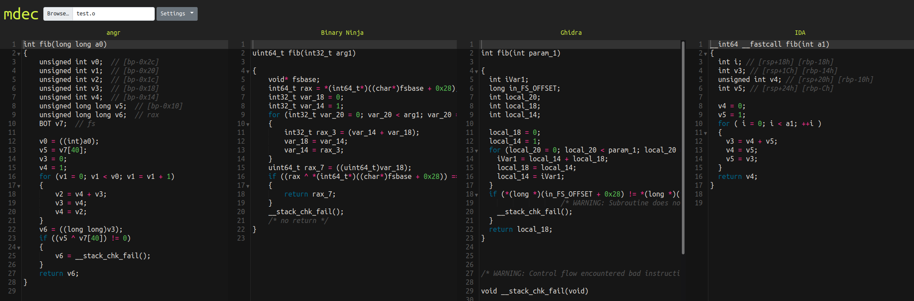

mdec
====

Explore multiple decompilers and compare their output with minimal effort. Upload binary, get decompilation.



Supported Decompilers
---------------------
* angr
* Ghidra
* IDA
* Binary Ninja

**Note:** For IDA and Binary Ninja, you must provide license and binaries. angr and Ghidra will be downloaded automatically.

Components
----------
* Each decompiler is a service that runs in its own container
* A frontend web service proxies requests to backend service

Install
-------
You'll need to add your proprietary packages in `backend/*/private`. Then just:
```
docker compose build
```

Run
---
```
docker compose up
```

Point your browser at http://127.0.0.1.

API
---
You can also request decomp like:
```
curl -F 'file=@test.o' http://127.0.0.1/ida/decompile
```

